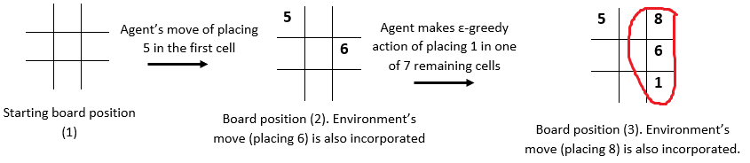

# Tic Tac Toe - Reinforcement Learning

Built an RL agent that learns to play Numerical Tic-Tac-Toe with odd numbers (the agent will always make the first move).We train  agent using Q-Learning. The environment is playing randomly with the agent, i.e. its strategy is to put an even number randomly in an empty cell. If your agent wins the game, it gets 10 points, if the environment wins, the agent loses 10 points. And if the game ends in a draw, it gets 0. Also, we want the agent to win in as few moves as possible, so for each move, it gets a -1 point.

 In this episode, the environment wins as it is able to make 15 first (8+6+1).  After the agent places 1 in one of the grids, the environment rewards it (with a negative reward of -1) and makes a next move of placing 8 in one of the remaining cells 
 
 We accomplish following in this :

Create an MDP for Numerical Tic-Tac-Toe game. The basic framework for this is:

Initialise the state

Define the action space for each state. (Be careful in defining actions. The actions are not the same for each state)

Define the winning states: the sum of three numbers in a row, column or diagonal is 15.

Define the terminal states (win,tie,loss)

Build the reward structure as below:

+10 if the agent wins (makes 15 points first)

-10 if the environment wins

0 if the game ends in a draw (no one is able to make 15 and the board is filled up)

-1 for each move agent takes

Define a step function which takes in an input of the agent’s action and state; and outputs the next state and reward. (Make sure you incorporate environment’s move in the next state).

For your reference: TCGame_Env.py file is provided with a basic structure of the code. The functions (and the comments) will provide an intuition of how the MDP would be formulated. Codes of a few functions are also provided to give you more sense on how to proceed with the MDP. Note: Using this framework is not compulsory, you can create your own framework and functions as well.

Build an agent that learns the game by Q-Learning. You can choose the hyperparameters (epsilon (decay rate), learning-rate, discount factor) of your choice. For that, you can train the model iteratively to obtain a good combination of hyperparameters. You won’t be evaluated on your choice of the hyperparameters. You need to submit only the final model. 

While updating the Q-values, if the next state is a terminal state, then the Q-values from that state are 0. (No action is possible from that state)

For a 64-bit system with 8GB RAM, it takes ~30 minutes to run 5Mn episodes.

Q-values convergence- check whether Q-values learnt by the agent have converged or not. Sample 4 state-action pairs and plot it with the number of episodes to understand the convergence.

